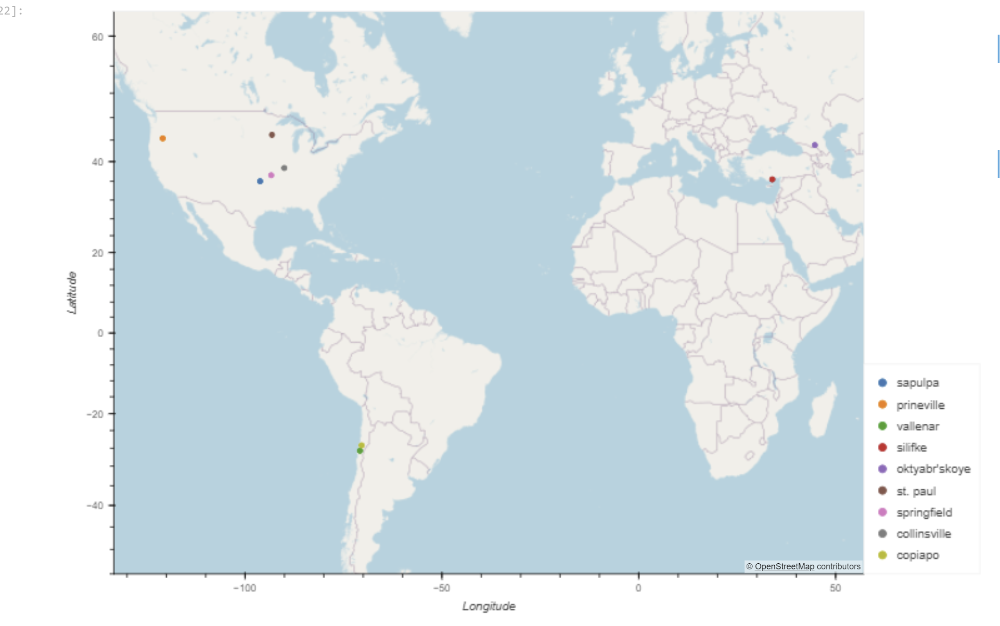

WEATHERPY AND VACATIONPY CHALLENGE
1. Project Overview and Purpose:
This exercise will offer two key resources for the user: (a) a visualization of weather data for over 500 cities at various distances from the equator [referred to as "WeatherPy"], and (b) information such as city names and weather characteristics to assist in planning future vacations [referred to as "VacationPy"].
2. Dataset Description: 
Data for the WeatherPy component was partially retrieved from OpenWeather [api.openweathermap.org/] via an Application Programming Interface (API), yielding a JavaScript Object Notation (JSON) file after processing the API response. Additional data was sourced from a .csv file named "cities.csv," located in the output_data folder. This file includes information on location (city identifier, city name, and country), geographical coordinates (latitude and longitude), and weather details (maximum temperature, humidity, cloudiness, wind speeds, and date). Data for the VacationPy component was obtained from Geoapify [api.geoapify.com/] via API, also resulting in a JSON file after processing the API response, and was supplemented with information from the "cities.csv" file.
3. Data Cleaning and Preprocessing:
The API responses were already clean and were transformed into JSON format. The API responses were generated from specific data requests to each website and were visualized in DataFrames to assess their completeness and accuracy.
4. Data Visualization Techniques and result
For WeatherPy, scatter plots were created both with and without linear regression. For VacationPy, maps were generated.
5. Results and Analysis: 
(a) For WeatherPy, the following plots were produced: 
-	Maximum Temperature vs. Latitude:

-	 Humidity vs. Latitude:

-	Cloudiness vs. Latitude:

-	Wind Speed vs. Latitude:

-	Linear Regression for Temperature versus Latitude [Northern Hemisphere, and  Southern Hemisphere]:

Discussion about the linear relationship: There is a strong association between latitude and maximum temperature in cities. As you move toward the equator (Latitude = 0), the maximum temperature per city tends to increase. This pattern is evident both when moving northward from the south pole (from approximately -50 degrees to 0 degrees latitude) and when moving southward from the north pole (from around 80 degrees to 0 degrees latitude), where temperatures rise as you get closer to the equator.
-	Linear Regression for Humidity versue Latitude [Northern Hemisphere, and Southern Hemisphere]:

Discussion about the linear relationship: The r-values suggest a weak or nonexistent association between latitude and humidity as you approach the equator (0 degrees) from either pole. The relatively flat linear regression lines indicate that latitude cannot reliably predict humidity.
-	Linear Regression for Cloudiness versue Latitude [Northern Hemisphere, and  Southern Hemisphere]:	

Discussion about the linear relationship: The r-values suggest a weak or nonexistent association between latitude and cloudiness as you approach the equator (0 degrees) from either pole. While the clustering of points at 0% and 100% cloudiness may indicate a relationship between cloudiness and another factor, latitude itself is a poor predictor of cloudiness.
-	Linear Regression for Wind Speed versue Latitude [Northern Hemisphere, followed by Southern Hemisphere]:
'

Discussion about the linear relationship: The r-values suggest a weak or nonexistent association between latitude and wind speed as you approach the equator (0 degrees) from either pole. Similar to humidity, the relatively flat linear regression lines indicate that latitude cannot reliably predict wind speed.

(b) For VacationPy, the following maps were generated-
-	Map of Potential Vacation Cities with Marker Size Indicating Humidity (Larger Markers Represent Higher Humidity):

-	Map of prospective vacation cities where the temperature is between 21 and 27 degrees Celsius; no clouds; and the wind speed is less than 4.5 meters per second with hotel information:

6. Ethical Considerations:
The data obtained from API websites is typically accessible and does not include sensitive information. While collecting the .csv data in a similar format would require considerable effort, it also does not contain any sensitive information
7. References:
-	The Python code can be found in two files within the WeatherPy folder: 'WeatherPy.ipynb' and 'VacationPy.ipynb'
-	"cities.csv", filed in the output_data folder
-	Plots and maps are filed in in the output_data folder as .png files.
-	Xpert Learning Assistant
